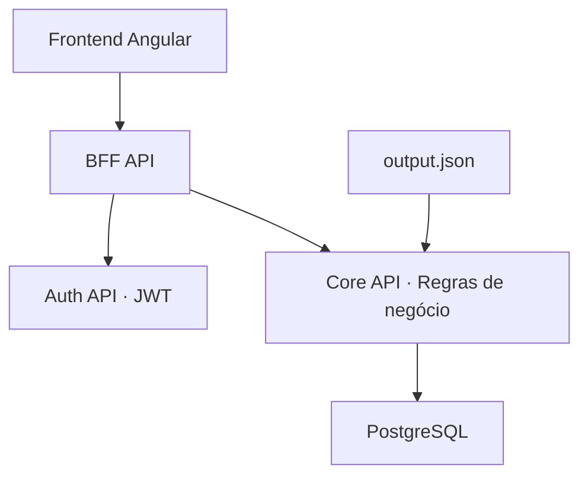

# GameLending — Controle de empréstimos de jogos

Aplicação desenvolvida para o desafio de engenharia de software do BTG. Organiza uma coleção de jogos e os empréstimos a amigos, permitindo consultar quem está com cada jogo, registrar devoluções e acompanhar o histórico.

## Visão de negócio

- Cadastro e consulta de jogos e amigos.
- Empréstimos e devoluções com histórico preservado.
- Consulta de jogos disponíveis e emprestados.
- Dashboard com a situação da coleção.
- Carga inicial de um catálogo público de jogos.

Um jogo só pode ter um empréstimo ativo. Jogos e amigos com empréstimos ativos não podem ser desativados. Cada jogo cadastrado representa um item emprestável; o catálogo inicial é demonstrativo.

## Arquitetura



| Componente | Responsabilidade |
|---|---|
| **Angular** | Telas de login, dashboard, jogos, amigos e empréstimos. |
| **BFF** | Entrada do frontend; encaminha operações e agrega dados para as telas. |
| **Auth** | Emite e valida tokens JWT com expiração, roles e scopes. |
| **Core** | Executa regras de negócio, persiste dados e importa o catálogo. |
| **PostgreSQL** | Armazena jogos, amigos, empréstimos e registros de importação. |

O backend utiliza **.NET 10**, com separação entre domínio, aplicação, infraestrutura e API. O Core organiza comandos e consultas separadamente; transações e um índice único parcial impedem empréstimos simultâneos do mesmo jogo. O frontend utiliza **Angular 22**.

## Preparação

Os comandos abaixo são para **PowerShell**, executados na raiz do projeto, onde estão `GameLending.sln`, `src` e `Infra`.

1. Instale e inicie o Docker Desktop com containers Linux e Docker Compose v2.
2. Crie a configuração local, caso ainda não exista:

   ```powershell
   if (!(Test-Path Infra/.env)) { Copy-Item Infra/.env.example Infra/.env }
   ```

3. Para carregar o catálogo, coloque o arquivo **`output.json`** em:

   ```text
   Infra/postgres/seed/output.json
   ```

   O arquivo está no [dataset PlayStation Games Info](https://www.kaggle.com/datasets/evgeny1928/playstation-games-info?select=output.json). Se o download vier em ZIP, extraia o JSON. **CSV não é aceito pelo importador atual.** Como alternativa ao download manual:

   ```powershell
   ./Infra/postgres/seed/download-dataset.ps1
   ```

As credenciais de `Infra/.env.example` são apenas para desenvolvimento. Não publique o arquivo `.env`.

## Opção 1 — Toda a aplicação no Docker

Não exige SDK .NET nem Node.js instalados na máquina.

```powershell
docker compose --env-file Infra/.env -f Infra/compose.yaml up --build -d
docker compose --env-file Infra/.env -f Infra/compose.yaml ps -a
```

O Compose inicia PostgreSQL, pgAdmin, Auth, Core, BFF e frontend. O serviço `db-migrate` aplica as migrations e termina com código `0`; isso é esperado. Em seguida, o Core importa o catálogo em segundo plano.

Para acompanhar a aplicação e a importação:

```powershell
docker compose --env-file Infra/.env -f Infra/compose.yaml logs -f core-api bff-api auth-api
```

O evento `Catalog import finished` indica o término da carga. Use `Ctrl+C` para sair dos logs sem parar os containers.

## Opção 2 — Aplicação no VS Code e PostgreSQL no Docker

Pré-requisitos adicionais: **VS Code**, extensão **C# Dev Kit**, **SDK .NET 10.0.100** (ou patch compatível com `global.json`), **Node.js 24.19.0** e **npm 11.9.0**, conforme as versões de referência do projeto.

### 1. Abrir o projeto e iniciar o banco

Abra a pasta raiz no VS Code e use o terminal integrado PowerShell. Se estava usando a opção 1, pare os containers primeiro para liberar as portas; o comando `down` preserva os volumes.

```powershell
docker compose --env-file Infra/.env -f Infra/compose.yaml down
docker compose --env-file Infra/.env -f Infra/compose.yaml up -d --wait postgres pgadmin
dotnet restore
```

### 2. Configurar o ambiente de cada terminal das APIs

Abra **três terminais PowerShell na raiz do projeto**, um para cada API. Execute este bloco em **cada um** antes do respectivo `dotnet run`. Ele lê os valores de `Infra/.env` e os converte para as configurações usadas pelo .NET; `dotnet run` não carrega esse arquivo automaticamente.

```powershell
$config = Get-Content Infra/.env -Raw | ConvertFrom-StringData
$env:ASPNETCORE_ENVIRONMENT = 'Challenge'
$env:Jwt__Issuer = $config.JWT_ISSUER
$env:Jwt__Audience = $config.JWT_AUDIENCE
$env:Jwt__SigningKey = $config.JWT_SIGNING_KEY
$env:Jwt__ExpirationMinutes = $config.JWT_EXPIRATION_MINUTES
$env:ConnectionStrings__Lending = "Host=localhost;Port=5432;Database=$($config.POSTGRES_DB);Username=$($config.POSTGRES_USER);Password=$($config.POSTGRES_PASSWORD)"
$env:Services__Auth = 'http://localhost:5002/api/v1/'
$env:Services__Core = 'http://localhost:5001/api/v1/'
$env:CatalogImport__Path = Join-Path $PWD.Path 'Infra/postgres/seed/output.json'
$env:CatalogImport__Enabled = 'true'
```

Esse bloco considera o formato simples `CHAVE=valor` fornecido em `Infra/.env.example`. Para iniciar sem catálogo, defina `$env:CatalogImport__Enabled = 'false'` no terminal do Core; os jogos poderão ser cadastrados pela interface.

### 3. Aplicar migrations e iniciar as APIs

**Terminal 1 — Core:** execute a migration e, quando ela terminar com sucesso, inicie a API.

```powershell
dotnet run --project src/Core/GameLending.Core.Api --no-launch-profile -- --migrate
dotnet run --project src/Core/GameLending.Core.Api --no-launch-profile --urls http://localhost:5001
```

**Terminal 2 — Auth:**

```powershell
dotnet run --project src/Auth/GameLending.Auth.Api --no-launch-profile --urls http://localhost:5002
```

**Terminal 3 — BFF:**

```powershell
dotnet run --project src/Bff/GameLending.Bff.Api --no-launch-profile --urls http://localhost:5000
```

Mantenha os três terminais em execução. O ambiente `Challenge` é necessário para a autenticação demonstrativa.

### 4. Iniciar o frontend

Em um **quarto terminal**, partindo da raiz:

```powershell
cd src/Web/game-lending-web
npm ci
npm start
```

Abra **http://localhost:4200**. O proxy do Angular já encaminha `/api` para o BFF na porta `5000`.

Para encerrar cada aplicação, use `Ctrl+C` no respectivo terminal.

## Acessos e credenciais locais

| Serviço | Endereço |
|---|---|
| Aplicação | http://localhost:4200 |
| Swagger BFF | http://localhost:5000/swagger |
| Swagger Core | http://localhost:5001/swagger |
| Swagger Auth | http://localhost:5002/swagger |
| pgAdmin | http://localhost:5050 |
| PostgreSQL, a partir do Windows | `localhost:5432` |

**Login da aplicação:** use `demo-client` e `demo-secret`. No modo `Challenge`, qualquer par de valores não vazios é aceito e recebe um token com duração padrão de 60 minutos. Esse comportamento existe apenas para o desafio.

Com o `.env` de exemplo, o banco é `game_lending`, o usuário é `game_lending` e a senha é `local-development-postgres-only`. No pgAdmin, entre com `admin@example.com` / `local-development-admin-only`; para conectar ao banco a partir dele, use o host **`postgres`**, porta `5432`, e as credenciais do banco. Se alterou o `.env`, use os valores correspondentes.

## Testes e encerramento

Na raiz, execute os testes .NET; as integrações do Core exigem Docker disponível:

```powershell
dotnet test --configuration Release
```

Para o frontend:

```powershell
cd src/Web/game-lending-web
npm test
npm run build
```

Na raiz, pare os containers preservando os dados:

```powershell
docker compose --env-file Infra/.env -f Infra/compose.yaml down
```

Detalhes adicionais: [arquivos de documentação](docs), [infraestrutura](Infra/README.md) e [resultados e limitações da validação](docs/validation-report.md).
